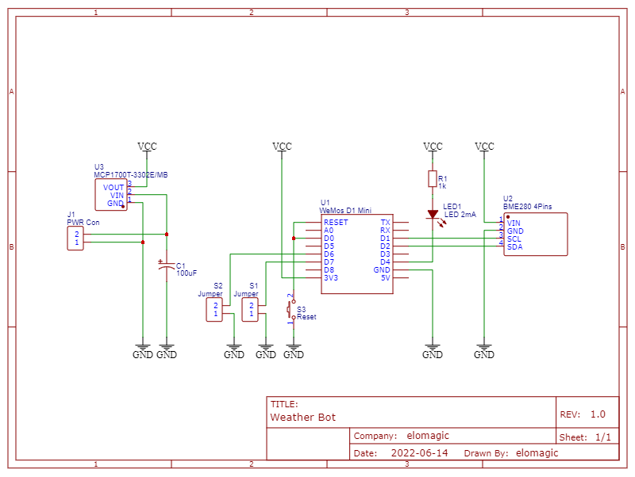
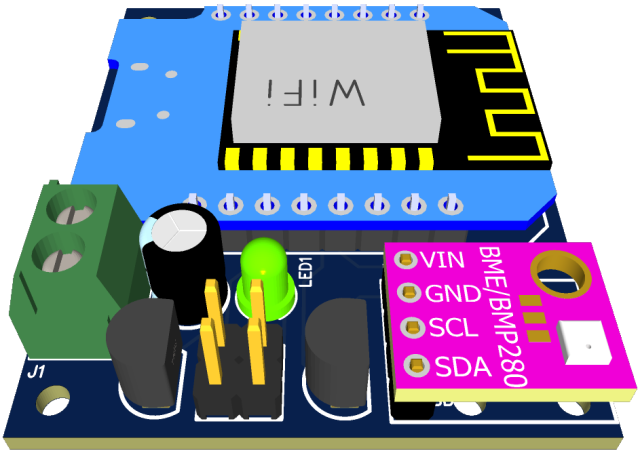
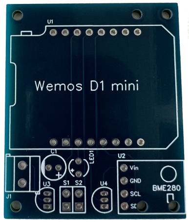
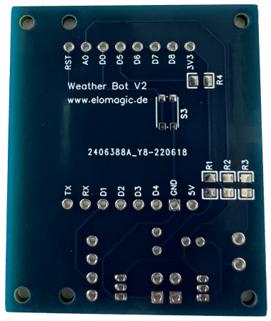
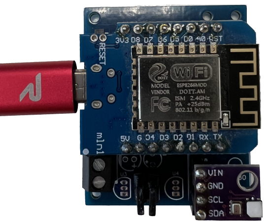
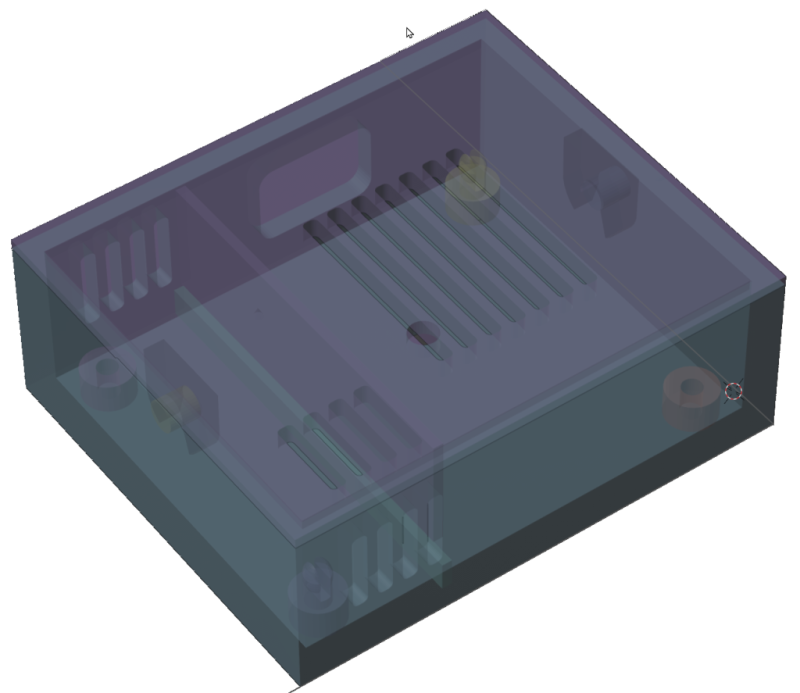

# DIY Weather Bot

---

[](https://github.com/elomagic/weather-station-client-mpy/tags/)
[](https://github.com/elomagic/spps-py/issues)
[](https://www.gnu.org/licenses/gpl-3.0-standalone.html)
[](https://www.micropython.org/)
[](https://github.com/elomagic/weather-station-client-mpy/graphs/commit-activity)
[](https://www.buymeacoffee.com/elomagic)

## Table of Contents

- [What about?](#what-about?)
- [Hardware component list](#hardware-component-list)
- [Preparing ESP](#prepare-hardware)
- [Configuration](#configure-bot)
  * [Configuring Bot](#configure-bot)
- [LED Codes](#led-codes)
- [Hardware Example](#hardware-example)
  * [Circuit diagram](#circuit-diagram) 
  * [PCB](#printed-circuit-board)
  * [Case](#device-case-proposal)
- [Known issues](#known-issues)

## What about?

This project is a part of my "small" DIY project about to build up a weather station mesh.

This part deals with the weather client, which measures temperature, air pressure and humidity and transmits them to any REST server.

The part with the REST server is described in another project. See here ... TODO

## Hardware component list


### Option A

Cheapest and simplest solution. The client will be powered by an external USB power supply.

#### Component list

* ESP8266 with at least 2MB flash memory and installed MicroPython image
  (2MiB+ flash version > https://micropython.org/download/?port=esp8266)
* BMP280 (w/o humidity sensor) or BME (with humidity sensor)

### Option B

The solution is powered by an external rechargeable battery.

#### Component list

In addition to the components from option A, the following components are required

* tbd.
* ...
* ...

### Optional

tbd.
  
## Prepare Hardware

Before you can start by configuring your bot, you have to upload the firmware. Recommendation is, that MicroPython is
successful running on your ESP.

(TODO) Install "ampy"

Upload the projects files with the following command

* ```ampy --port COM6 --baud 115200 put ./src /```

## Configure Bot

The weather bot support two configuration options.

1. Via pushing configuration file by using USB connection

    **Configuration file**
    
    ```properties
    # SSID of the access point
    wifi.ssid=ssid
    # Password of the access point
    wifi.password=changeit
    # IP address of this client when access point doesn't provide dynamically IP address. Usually empty
    wifi.address=
    # Usually empty
    wifi.netmask=255.255.255.0
    # Usually empty
    wifi.gateway=
    # Usually empty
    wifi.dns=8.8.8.8
    # Name of client bot
    wifi.clientName=[BOT_NAME]
    
    # Unique identifier of this client ( Looking for a generator. See https://www.uuidgenerator.net/version4 )
    sensor.uid=uuid
    # Measure interval in seconds
    sensor.measureInterval=60
    
    # URL server address. Sample "http://192.168.150.2/rest" 
    server.url=http://[HOSTNAME]/rest
    # Application key to authentication
    server.appKey=
    ```

    **Command to write configuration to ESP**
    ```powershell 
    .\Setup-Client.py write --port COM7 --file configuration.json
    ```

3. Via Web UI of the weather bot
    * Power on ESP
    * Connect the ESP via Wi-Fi. Look for the SSID "Weather-Bot". Password is "weather-bot".
    * The configuration page appears. Configure the bot according to your needs.

## LED Codes

The LED gives feedback on successful and faulty communication. 

Please ignore the very short flash when counting. Each flash is min. half a second long

| Count | Description                        |
|:-----:|------------------------------------|
|   0   | Worst case. We have to investigate |
|   1   | Data successfully transmitted      |
|   2   | Entering setup                     |
|   3   | Unable to connect to access point  |
|   4   | Unable to post data to server      |
|   5   | Unable to connect NTP server       |
|   6   | Unexpected error                   |

## Weather Client Data Model

The following example shows which data is transmitted:

### HTTP Command
```http request
POST /rest/measure HTTP/1.1
Host: weather-server.local
```

### Payload
```json5
{
    // UID of the measure sensor
    "sensorUid": "892ed1a5-a416-418d-b478-78d7ff744b2e",
    // UNIX epoch timestamp of the measurement in seconds 
    "unixEpochTimestamp": "1656914554",
    // Measured temperature 
    "temperature":  "31.52",
    // Unit of the measured temperature 
    "temperatureUnit":  "C",
    // Measured pressure
    "pressure": "999.49",
    // Unit of the measured pressure
    "pressureUnit":  "hPA",
    // Measured  humidity in percent
    "humidity":  "33.8064",
    // Battery voltage
    "batteryVoltage":  "3.3"
}
```

## Hardware Example

### Circuit diagram



### Printed Circuit Board

Example coming soon






### Device Case Proposal

Proposal of a device case. Made with [Blender](https://www.blender.org).




## Known Issues

* TLS (HTTPS) communication doesn't work

## Outlook - Possible further ideas

* MQTT support
* TLS fixed (This will be very difficult to impossible. TLS needs a lot of memory and the ESP8266 has not enough of it.)